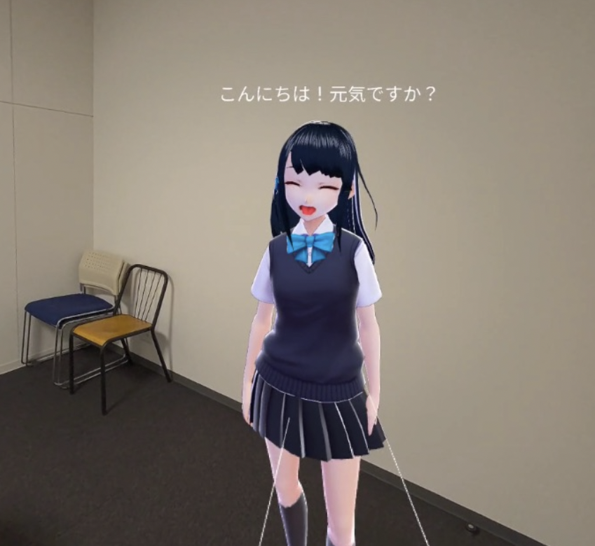

# MRTalk

[](https://skillicons.dev)

# DEMO



# self host

## Requirements

- [marukun712/MRTalk](https://github.com/marukun712/MRTalk)
- [marukun712/MRTalk-GPT-SoVITS](https://github.com/marukun712/MRTalk-GPT-SoVITS)

## MRTalk

### Google OAuth

GCPでOAuthのクライアントIDを取得して、.envに設定してください。\
承認済みのリダイレクトURIは、`http://ドメイン名/api/auth/callback/google`を設定する必要があります。\
cloudflare-tunnelまたはngrok等を用いてローカルホストを公開する必要があります。(VRからアクセスする場合)\
ngrokを用いる場合は、ドメインを固定してください。 \

### Setup

```bash
$ mise i
$ bun i
$ cp .env.example .env
$ bun run dev

$ cd ai-assistant
$ rye sync
$ cp .env.example .env
$ rye run python src/setup.py
$ rye run dev
```

## MRTalk-GPT-SoVITS

GPT SoVITS works with Google Colab free plan.
https://colab.research.google.com/drive/1RbVjXdGPCFAOSOhVj3OhblazhAI057fT
