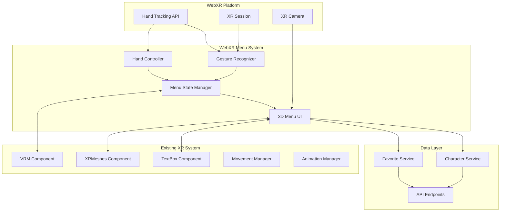
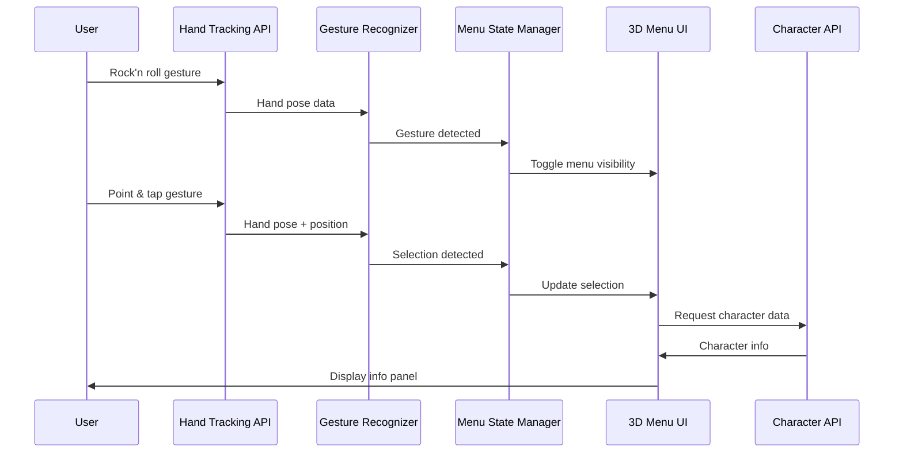

# MRTalk WebXRメニューシステム統合 技術設計書

## 1. プロジェクト概要

### 1.1 システム要件

- **WebXRハンドトラッキングAPI**を使用したMixed Reality (MR)
  アプリケーション用メニューシステム
- **Rock'n
  rollジェスチャー**（人差し指と小指を立て、中指と薬指を折る）でメニュー表示・非表示を切り替え
- **ハンドトラッキングによるポイント&タップ操作**でメニューアイテム選択
- **キャラクター情報UIパネル**（名前、性格、ストーリー、お気に入り状態）を3D空間に配置
- **3D空間内の固定位置**に配置される空間UI
- **視線方向への自動回転機能**を含む

### 1.2 現在のプロジェクト構造

- **Remix.js**ベースのWebアプリケーション
- **[@react-three/xr](app/components/container/TalkSceneContainer.tsx:2)
  (6.6.9)**、**[@react-three/fiber](app/components/container/TalkSceneContainer.tsx:1)
  (8.1.0)**、**Three.js (0.174.0)** 使用
- **[@react-three/uikit](app/components/xr/TextBox.tsx:4) (0.8.12)** による3D
  UI構築
- **[@pixiv/three-vrm](app/components/xr/VRM.tsx:23) (3.3.6)**
  によるVRMモデル管理
- 既存のXRシステム：[VRM](app/components/xr/VRM.tsx:27)、[TextBox](app/components/xr/TextBox.tsx:8)、[XRMeshes](app/components/xr/XRMeshes.tsx:1)
  コンポーネント

## 2. システムアーキテクチャ設計

### 2.1 アーキテクチャ図



### 2.2 コンポーネント構成とファイル配置

```
app/
├── components/
│   └── xr/
│       ├── menu/
│       │   ├── WebXRMenu.tsx                 # メインメニューコンテナ
│       │   ├── MenuPanel.tsx                 # 3Dメニューパネル
│       │   ├── CharacterInfoPanel.tsx        # キャラクター情報表示
│       │   ├── MenuButton.tsx                # メニューアイテム
│       │   └── HandPointer.tsx               # ハンドポインター視覚化
│       ├── VRM.tsx                           # 既存（拡張）
│       ├── TextBox.tsx                       # 既存
│       └── XRMeshes.tsx                      # 既存
├── lib/
│   └── xr/
│       ├── menu/
│       │   ├── MenuStateManager.ts           # メニュー状態管理
│       │   ├── GestureRecognizer.ts          # ジェスチャー認識
│       │   ├── HandController.ts             # ハンド操作制御
│       │   ├── SpatialMenuManager.ts         # 3D空間メニュー管理
│       │   └── types.ts                      # 型定義
│       ├── vrm/                              # 既存
│       └── navigation/                       # 既存
└── routes/
    └── talk.$id.tsx                          # 既存（統合ポイント）
```

### 2.3 データフロー設計



## 3. 実装設計詳細

### 3.1 GestureRecognizer クラス設計

```typescript
interface GestureRecognizer {
    // Rock'n rollジェスチャー検出
    detectRockAndRoll(handPose: XRHandPose): boolean;

    // ポイント&タップジェスチャー検出
    detectPointAndTap(handPose: XRHandPose): {
        isPointing: boolean;
        isTapping: boolean;
        position: Vector3;
    };

    // ジェスチャー履歴管理
    updateGestureHistory(gesture: GestureType): void;
}
```

### 3.2 MenuStateManager クラス設計

```typescript
interface MenuState {
    isVisible: boolean;
    selectedItem: string | null;
    position: Vector3;
    rotation: Euler;
    items: MenuItemData[];
}

interface MenuStateManager {
    // メニュー状態管理
    toggleVisibility(): void;
    selectItem(itemId: string): void;
    updatePosition(cameraPosition: Vector3): void;

    // 3D空間配置
    calculateOptimalPosition(userPosition: Vector3): Vector3;
    updateRotationToFaceUser(userPosition: Vector3): void;
}
```

### 3.3 SpatialMenuManager クラス設計

```typescript
interface SpatialMenuManager {
    // 3D空間内メニュー配置
    positionMenu(basePosition: Vector3): void;

    // レイキャスティング
    performRaycast(handPosition: Vector3, direction: Vector3): MenuItem | null;

    // ビジュアルフィードバック
    highlightItem(item: MenuItem): void;
    showHandPointer(position: Vector3): void;
}
```

## 4. 既存システムとの統合ポイント

### 4.1 TalkSceneContainer.tsx 統合

```typescript
// app/components/container/TalkSceneContainer.tsx
import WebXRMenu from "../xr/menu/WebXRMenu";

export default function TalkSceneContainer(
    { character }: { character: Character },
) {
    return (
        <Main>
            <Button onClick={() => store.enterAR()}>Enter MR</Button>
            <Canvas>
                <XR store={store}>
                    <ambientLight />
                    <XRMeshesComponent transparent={true} opacity={0} />
                    <VRM character={character} />
                    <WebXRMenu character={character} /> {/* 新規追加 */}
                </XR>
            </Canvas>
        </Main>
    );
}
```

### 4.2 VRM.tsx 統合

```typescript
// app/components/xr/VRM.tsx に追加
import { useMenuState } from "~/lib/xr/menu/MenuStateManager";

export default function VRM({ character }: { character: Character }) {
    const menuState = useMenuState();

    // 既存のコード...

    // メニューとの連携
    useEffect(() => {
        if (menuState.selectedAction) {
            handleMenuAction(menuState.selectedAction);
        }
    }, [menuState.selectedAction]);
}
```

## 5. 実装フェーズ提案

### Phase 1: 基盤構築（週1）

- [ ] 基本的なジェスチャー認識システム実装
- [ ] [`MenuStateManager`](app/lib/xr/menu/MenuStateManager.ts:1) の基本機能実装
- [ ] Rock'n rollジェスチャーによるメニュー表示・非表示

### Phase 2: 3D UI構築（週2）

- [ ] [@react-three/uikit](app/components/xr/TextBox.tsx:4)
      を使用した3Dメニューパネル実装
- [ ] キャラクター情報表示パネル実装
- [ ] 3D空間内の固定位置配置とユーザー視線追従

### Phase 3: インタラクション実装（週3）

- [ ] ハンドトラッキングによるポイント&タップ操作
- [ ] レイキャスティングによるメニューアイテム選択
- [ ] ビジュアルフィードバック（ハイライト、ポインター表示）

### Phase 4: 統合とパフォーマンス最適化（週4）

- [ ] 既存VRMシステムとの統合
- [ ] キャラクターAPIとの連携
- [ ] パフォーマンス最適化とバグ修正

### Phase 5: ユーザビリティ向上（週5）

- [ ] UIデザインの洗練
- [ ] アクセシビリティ対応
- [ ] エラーハンドリングとフォールバック

## 6. パフォーマンス最適化戦略

### 6.1 レンダリング最適化

- **フラストラムカリング**: ユーザーの視野外のメニュー要素の描画を停止
- **LOD (Level of Detail)**: 距離に応じたメニューの詳細度調整
- **オブジェクトプーリング**: メニューアイテムの再利用

### 6.2 ジェスチャー認識最適化

- **フレームレート調整**: 30fps でのジェスチャー認識（60fps描画と分離）
- **デバウンス処理**: 誤認識防止のための時間的フィルタリング
- **信頼度しきい値**: ジェスチャー認識の信頼度による判定

### 6.3 メモリ管理

- **テクスチャ圧縮**: メニューアイコンとUIテクスチャの最適化
- **ガベージコレクション**: 不要な3Dオブジェクトの適切な破棄

## 7. 技術参考資料

### 7.1 WebXR Hand Tracking

- [WebXR Hand Input Module - Level 1](https://www.w3.org/TR/webxr-hand-input-1/)
- [Handy.js hand pose recognition](https://stewartsmith.io/work/handy-js) -
  カスタムハンドポーズ認識ライブラリ

### 7.2 使用技術スタック

- **WebXR**:
  [@react-three/xr](app/components/container/TalkSceneContainer.tsx:2) (6.6.9)
- **3D Rendering**:
  [@react-three/fiber](app/components/container/TalkSceneContainer.tsx:1)
  (8.1.0), Three.js (0.174.0)
- **3D UI**: [@react-three/uikit](app/components/xr/TextBox.tsx:4) (0.8.12)
- **VRM Support**: [@pixiv/three-vrm](app/components/xr/VRM.tsx:23) (3.3.6)

---

**作成日**: 2025/5/24\
**バージョン**: 1.0\
**ステータス**: 設計承認済み
